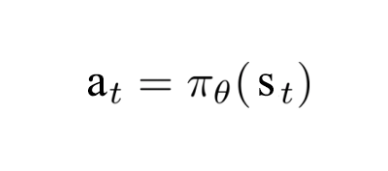
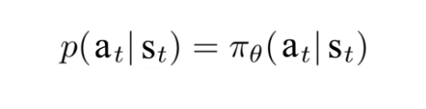

# super-mario-Reinforcement-learning
It's a repository for super-mario Reinforcement learning

## Introduction
The objective of this repository is to explore the reinforcement-learning models for playing super-mario. In this project, we experiment two types of reinforcement learning, one is Asynchronous Advantage Actor-Critic (A3C) and one is Proximal Policy Optimization (PPO) which was proposed by OpenAI. In this repo, we attempt to run both methods on MACOS and Google Colab environments. Step-by-step tutorialare as below.  

<p align="center">
  
  
  <br/>
  
  
  <br/>
  
  
  <br/>
  <i>Sample results</i>
</p>

## Method 

Reinforcement learning

The algorithmn having model tring out different possibilities and improved based on the feedback give back by the environment. In this case, the game is the enviroment and the score or the distance traveled is the feedback. 

In more detail, RL is built based on Markov Decision Progress (MDP) which composed of:


The reward is granted when the agent's action satisfy the policy, as time goes on, the future reward is smaller than the current value:


where the  deterministic is defined as: 



with its objective funtion as define: 


The policy can be determinlistic or stochastic. For stochastic, we have probablity distribution :



with the objective function:


A3C method:

Actor-critic are similar to GAN method in computer vision method whre we have two agents, one agent (actor) is trying to explore the environtment, and one agent (critic) rewards the point or punish depend on how the actor agent does. If the actor agent move foward with the game, the critic agen positively reinforce by rewarding the points until the actor agent reaches the end game. Advance actor-critic is where the critic agent need to compare multiple actions, and reward the better ones. For Asynchronous Advantage Actor-Critic, we have multiple actor agents discover different path at once, and the critic agent need to determine the best outcome. Thus, A3C is a more advanced method which help fasten the training.

Possible loophole: The critic agent may falsely understand the situation which may cause the algorithmn unable to improve further. Exmaple might be decision that may lead to rare case of the game such as opening hidden gateway in some games. Sometimes this loophole will not be a problem if the algloroithn gets lucky, but in reality algorithmn will face a lot of problem with it if the chance for trying the game is limited.

PPO method: While A3C method is good to help fasten the training, it is not yet stable, thus, OpenAI propose a optimization method where gradient descent can enables multiple epochs of minibatch updates


# Super Mario Bro Procedure (how to run code)


```
$git clone https://github.com/Kaiyuan888/super-mario-Reinforcement-learning.git
```

Install dependencies (for MACOS)
 
 ```
 $Python3 -m pip install gym gym-super-mario-bros opencv-python torch torchvision tensorboardX
 ```
 ```
 $Brew install ffmpeg
 ```
To use pretrained weights:
```
python3 test.py
```

To train the mode, first remove all pretrained weights, then run:

```
python3 train.py
```
 
 
 
 
 ### on Google colab:
 Similarly to running training on local computer, to clone the repo into google colab and utilize GPU to train the model. Once we finished and obtain the weights, we need to download the weights and run test on local computer due to GUI limitation on Google Colab. 
 
 ```
 !git clone https://github.com/Kaiyuan888/super-mario-Reinforcement-learning.git
 !pip install gym gym-super-mario-bros opencv-python torch torchvision tensorboardX
 !python train.py
 ```
 # Conclusion 
 
 This type of reinforcement learning algorithm is good for conquering simple game. The advantage that this type has is that the model is relativly simple and fast. The disadvantage is that it can only conquer simple game and takes many iterations in the enviroment to get to a relative good place, however getting environment that allows many attempts and processing at high speed is hard. Having complex model with previous knowledges and other features might be a good idea for dealing with complex game, but the problem is that the previous knowledges might takes years to train. 

# reference:
Schulman, J., Wolski, F., Dhariwal, P., Radford, A., & Klimov, O. (2017). Proximal policy optimization algorithms. arXiv preprint arXiv:1707.06347.

Mnih, V., Badia, A. P., Mirza, M., Graves, A., Lillicrap, T., Harley, T., ... & Kavukcuoglu, K. (2016, June). Asynchronous methods for deep reinforcement learning. In International conference on machine learning (pp. 1928-1937).
# code reference:
https://github.com/uvipen/Super-mario-bros-A3C-pytorch.git

https://github.com/uvipen/Super-mario-bros-PPO-pytorch.git
